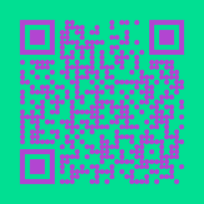

# QR-Code-Creator
Replit Application for creating a QR-Code
---

- [Samples](#Sample-Generations)
- [Installation](#Installation)
- [How to](#How-to)
- [Recommended Use](#Recommended-Use)

 

---

### Sample Generations

</img>
</img>
</img>
</img>
</img>
</img>
</img>
</img>

---

### Installation

No installation required. You simply can [click here](https://replit.com/@xXAIbotXx/QR-Code-Creator?v=1) and run it on Replit.
  
If you want it though, you can fork/clone this repository and run the main.py as python file.

---

### How to

**Simply:** 
Follow the instructions in the application, this should lead you to your QR-Code.
  

**Extended:** 
 
Type the content in the console which the QR-Code should contains. 
 
Now a normal QR-Code will be generated and you will see a preview of the QR-Code. The real QR-Code can now be downloaded from the output folder. 
  
 
Thats it. If you want a diffrent and individual look, you can press enter to generate a QR-Code with random style. 
And if you want to set the setting manually, you can type change. Of course you can combine these things. 
 
In the manually settings you can go back with typing back. Moreover you can change the content which you typed in the beginning. Additionaly you can change the front and background color with typing fill_color / back_color. 
You can also change the draw type and the color mask with typing type or mask.

> You always can leave with the **exit** statement!

---

### Recommended Use

I recommend that you first type your content, than press so often enter until the random content agrees with you and than make fine tuning with typing change. 
 
Now you go to the files and can download the QR-Code.  

> Make sure the draw type looks good for you (in the preview you can't see it -> it stands as text below)

---

